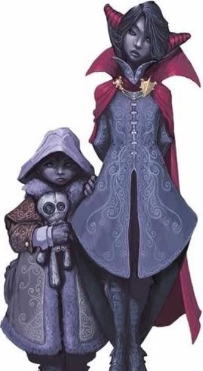

# CURSE OF STRAHD MONDAY NIGHTS

### THE PARTY MOVEMENT ORDER;

|PLAYER  |AKA           |SPECIALTY                                                                   |
|---     |---           |---                                                                         |
|ERRAMUS | ERRANDBOY    | THE BRAINS OF THE OPERATION BECAUSE HE IS THE ONLY ONE WHO CAN OPEN A DOOR |
|[NIKKEY](CHARACTER.MD)  | THE PROVACTURE      | STEALTH, FORGERY, DECEPTION AND DRUGS                  |   
|SKYLARC | THE SHIELA       | SHE GETS PISSED EASILY                                                     |
|SEBI    | SEABISCUIT OR STINKY | STRONGEST MAGE HAND IN THE LAND                                    |
|EREBUS  | BUSBOY       | BURNING THINGS AND LOVER OF ELF'S                                          |
|~~NILNEAK(DEAD)~~| NILLYWILLY   | ELDRITCH BLAST FIRST, ASK QUESTIONS LATER, DIED TRAGICALLY        |
|HALY HALFJORD | HAL             | THE CELEBRICUTIONER                                               |

### NPC'S ENCOURTERED BY THE PARTY
___PEOPLE WHO HAVE GIVEN US QUESTS;___ 
- DUTCHY OF DAGGERFOR - MOTIVATIONS UNKOWN, HUSBANS IS DEAD AND SHE IS SCARED, SENT US 
TO FIND SOMEMISSING PEOPLE.
- ROSE & THORN - ROSAVALDA DURNST UNKOWN WHAT THEY WANT US TO PLAY WITH THEM

___THE PEOPLE WE ARE LOOKING FOR;___ 
- BELLA THE BRAVE
- KRYSTOPF - FIGHTER
- JOESLINE - MAGIC USER 
- DOMINIQUE - ROGUE - LIKELY DEAD, KNIKKEY GOT HIS HAND I THINK

___PEOPLE OF INTEREST;___
- STRAHD            - BAD GUY, A MESSIAH, NOT HERE TO LEAD, WE ARE ON HIS EARTH
- IRENA             - GOOD, BURGOMASTERS DAUGHTER
- ISMARK            - GOOD, BURGOMASTERS SON
- KOLYAN INDIROVICH - GOOD, DAUGHTER BITTEN BY VAMPIRE, SEEKS TO HELP TO CONTAIN A VILE CREATURE WHO HAS BECOME TO POWERFUL, SEEKS TO CONTAIN THIS POWER WITHIN BAROVIA, PERHAPS HAS A 
REWARD FOR DOMINIQUE, I AM DOMINIQUE 
- ROSE & THORN      - UNKNOWN - ROSAVALDA DURNST
- GUSTAV DURST      - BAD GUY, TORTURED PEOPLE IN HIS DUNGEON, MOTIVATIONS UNKNOWN, PERHAPS IMMORTALITY
- ERRAND BOY TALKS TO DOOR AND TELLS IT TO BACK THE FUCK OFF...
- GERTRUDAL - MISSING GIRL, DOESNT HAVE HER DOLL
- DONOVITCH AND DORU - PRIESTS WHO HAS SON CHAINED IN BASEMENT OF CHURCH OF LATHANDER WHO WE KILLED

### PLACES
- BAROVIA - HAS A DEVIL THAT MUST BE CONTAINED 
- DAGGERFORD - SWORD COAST TOWN, NIKKEY PLAYED A LOT OF BALDURS BONES
- KRESK - ABBEY ?
- VALAKI  - ?

### QUESTS 
- FIND THE MISSING PEOPLE FOR DUTCHY
- ROSE AND THORN WANT US TO PLAY IN SCARY HOUSE
- ISMARK AND IRENGA NEED TO ESCAPE BAROVIA
- IRENA WONT LEAVE UNTIL HER FATHER IS BURRIED
- GERTRUD MISSING CHILD

### ITEMS 
- BLOOD VELVET COIN PURSE WITH 20 GOLD - EVERYONE
- DECAYED HAND - NIKKEY
- TIGER RUG - NIKKEY
- OLD HAGS CART- GAVE TO MADAME EVA TO GET AROUND
- __DOMINIQUE'S LETTER__
- 


- __STRAHD'S LETTER__  


- DURNST DOCUMENTS - DURST WILL AND DEED


# INTO THE MISTS
- NIKKEY CONVINCES THE DUTCHESS TO GIVE US ALL 20 GOLD PEICES TO FIND SOME MISSING PEOPLE.
- WE ALL GET ENVELOPED BY A THICK UNATURAL FOG WHICH WE APPEAR TO BE LOST IN UNTIL WE FIND A 
GATE WITH HEADLESS STATUES.

- ERREBUS GETS US ALL INSPIRATION FOR PUTTING TO REST A MAN WHO WAS HANGING IN A TREE, PROBABLY 
ONE OF THE DEAD GUYS WE HAVE BE LOOKING FOR.
- NICKY CLIMBS THE DEAD TREE AND SEES A LIGHT  WHICH THEY FOLLOW TO BIG SCARY HOUSE

# HAUNTED HOUSE
- OUTSIDE OF THE LIGHT UP HOUSE, THE PARTY AGREE'S TO TAKE A LOOK AT THE BASEMENT TO ENSURE FOR A GOOD 
NIGHTS REST FOR SOME SMALL CHILDREN ROSE AND THORN
- 
- ONCE INSIDE EVERYONE IS GIVEN A FEAST, EXCEPT NIKKEY DOES DRUGS UPSTAIRS AND CANNOT SLEEP DUE TO PARANOIA.
- AFTER ARGUING OVER IS THE HOUSE SAFE, FINALLY THE DECIDE TO SLEEP.
- THEY WAKE TO CHILLS AND APPEAR TO BE WALLED IN THE HOUSE BY BRICKS.

--------------------------------------------------------------------------------------
- NIKKEY STILL HIGH, CAN'T SLEEP AND EVENTUALLY SEES A SPECTRAL IMAGE OF A SERVANT AND TRYS TO WAKE 
EVERYONE UP. 
- NILNEAK JUST WANTS TO SLEEP EVEN AFTER EVERYONE GOES DOWNSTAIRS AFTER HEARING MORE NOISES DOWNSTAIRS
- A FEW OF US GO DOWNSTAIRS AFTER 30 MINUTES OF TRYING TO FIGURE OUT HOW DARKVISION WORKS IN ROLL20 
AND WE FIND A NEW PARTY MEMBER A NEW CLERIC ERASMUS WHO ACTUALLY PROBABLY LIKES ELF'S UNLIKE SOME PEOPLE
- AFTER ANOTHER 30 MINUTES  OF TRYING TO FIGURE OUT WHATS GOING ON, NIKKEY DARINGLY DECIDES TO OPEN A DOOR, 
WHICH SEABISCUIT DECIDED WAS BETTER TO OPEN USING A MAGE HAND BUT NIKKEY SLAPPED THAT MAGE HAND AWAY.
- THE FOOD EVERYONE ATE, WAS ACTUALLY OLD AND ROTTING AND PEOPLE ARE NOW GETTING POISENED
- UNPROVOKED NILNEAK JUST RANDOMLY DECIDES TO START VANDALIZING ROSE AND THORNS HOUSE WITH ELDRITCH BLASTS
AND GETS ATTACKED BY GLASS EYED DOG. NILNEAK IS CLEARLY NOT AN ANIMAL LOVER AND HAS NEVER HEARD OF ARSON.
- AFTER WHAT SEEMS LIKE FOREVER THEY GO UPSTAIRS AND NN A DARE, NIKKEY SPRUNG A SUIT OF TRAP OF MAGICAL ARMOR, 
SKYLARC WRESTLED WITH THE MAGICAL ARMOR AND THREW IT OFF THE BALCONY, THEN NIKKEY JUMPED OFF A 30 STORY 
BALCONY, WHICH HE ROLLED A CRIT TO VANQUISH THE ARMOR AND SAVE THE DAY 
- AS THEY SEARCHED MORE ROOMS FOUND A TIGERSKING RUG/CLOAK AND USED IT TO CREATIVELY ENSARE A BROOM WITH A CRIT, AND IMMEDIATLY 
AFTER EREBUS ROLLED A CRIT AND SMASHED IT TO PEICES... THATS FUCKING TEAMWORK.
- HE ALSO FOUND A TREASURE CHEST FULL OF SOME DOCUMENTS, MAGICAL SCROLLS, AND PROCURRED A POISON DART FROM
A TRAP. POISON WAS FATALLY STRONG ENOUGHT KILL SOMEONE.
- STRAHDS LETTER - NIKKEY EXAMINED STRAHDS LETTER AND BEGAIN FORGING DOCUMENTS FROM STRAHDS HANDWRITTING 
```
TO WHOMEVER READS THIS LETTER, 

PLEASE EXTEND THE FINEST HOSPITALITY BAROVIA HAS TO OFFER TO THE COMPANIONS WHO 
HAVE THIS LETTER. YOUR LORD EXPECT YOU WILL TREAT THEM WITH THE HIGHEST REGARD AND 
EQUIP THEM WITH WHATEVER THEY SO DESIRE FOR WHICH I WILL REIMBURSE AT FOUR TIMES THE 
RATE. MY BUSINESS WITH THESE TRAVELLERS IS A PRIVATE MATTER MATTER AND YOUR DISCRETION
IS ADVISED.

THE PENALTY FOR NOT HONORING YOUR LORDS WISHES WILL HAVE DIRE CONSEQUENCES.

YOUR DREAD LORD AND MASTER,
STRAHD VON ZAROVICH
```
- NIKKEY EXAMINED - THE DURST DEEDS WANTS TO TAKE OWNERSHIP OF THE PROPERTIES, WANT'S ROSE AND THORNS 
BLESSING TO RESTORE THE HOUSE FOR THE CHILDREN
- FOUND A HIDDEN ROOM, IN THE DOLL HOUSE WHICH WAS A MINIATURE COPY OF THE HOUSE
- NIKKEY GOT REALLY AFRAID AFTER TOUCHING THORNS BEAR
__________________________________________________________

- THE PARTY MAKES ITS WAY INTO THE BASEMENT AND THE DARKNESS CONSUMES THE PARTY
- NOBODY CAN SEE ANYTHING UNTIL EREBUS BEGINS BURNING TABLES AND BLESSING THE PARTY WITH ITS FIRE
- NIKKEY TAKE CHARGE AND CALLS OUT TO THE PARTY TO GROW A PAIR AND TAKE SOME ACTIONS
- THE PARTY FINDS A NEW PARTY MEMBER TRAPPED IN A ROOM NEEDING HELP
- HE TELLS US THAT HE WAS TRICKED SOME YOUNG KIDS TO ENTER THE HOUSE AND HAS BEEN TRAPPED
- WE TELL HIM THAT WE WILL HELP BUT HE BETTER NOT SLOW US DOWN
- EREBUBUS ENTERS A NEW ROOM AND BEGINS BURING EVERYTHING IN SIGHT
- NICKEY CAN FINALLY SEE AND STARTS TO DASH TOWOARD TOWARDS THE EAST FEELING A A DARK POWER FLOW THROUGH HIM WHICH IS CLEARLY SOME DRUGS THAT HE HAS CONSUMED
- NICKEY DASHES IN A HAZE TO AND GETS ATTACKED BY GHOULS WHO LITERALLY BEAT HIM TO 1 HIT POINT BEFORE HE SLAYS BOTH OF THEM AND CALLS OUT TO
- A FEW MOMENTS TO TO TAKE SOME DRUGS AND GET HIMSELF FIXED, THINGS ARE LOOKING GOOD
- FINALLY THE SHIELA AND THE REST OF THE RAG TAG GROUP FINALLY GET SOME ACTION AND KILL SOME GHOULS.
- A POSSESED DOOR ATTACKS THE GROUP TRYING TO EAT ERASMUS
- EREBUS CALLS OUT TO THE DOOR IN DIMESINONAL AND CONVINCES US TO LET US PASS
_____________________________________________________________

- ERROND BOY FALLS IN PIT AND ALMOST DIES
- NIKKEY TRYS TO OPEN UP SOME CHESTS
- THE PARTY TRAVELS DOWN ANOTHER LEVEL AND FINDS A ROOM THAT IS STACEKD WITH DARK TRINKETS
```
KNIFE FROM HUMAN BONE
DAGGER RAT SKULL 
8 INSH ORB FROM EYEBALLS
TOTEM THAT HAS CRUMBLED FROM BONE 
CLOAK FROM STICHTED GHOUL SKIN
FROG ATTACHED TO STICK
COMPONENT BAG
HAGS FINGER 
6 INCH TALL MUMMY 
IRON PENDANT WITH A DEVILS FACE
```
- THE PARTY TRAVELS DOWN FURTHER AND COMES ACROSS A ALTER
- KNIKKEY TOUCHES THE ALTAR AND IS SURROUNDED BY A HORDE OF SHADOWS THAT DEMAND A SACRIFICE
- NIKKEY SACRIFICES SEABISCUITS SPIDER, BUT THE SHADOWS WANT MORE BLOOD
- THEN OUT COMES LORGOTH THE SHAMBLING MOUND TO TAKE THE BLOOD
- A EPIC BATTLE IS UNDERTAKEN AND THE PARTY VANQUISHES THE SHAMBLING MOUND
- - 
- THEY LEAVE THE DURST HOUSE
- BEGIN TRAVELING TO BAROVIA, THEY ARE TIED AND DECIDE TO TAKE A REST JUST OUTSIDE THE CITY
- A EYE WATCHES THEM AND TELLS THEM TO GET ON THERE WAY
- WE COME ACCROSS SOME FARMERS, NIKKEY TRIES TO GET INFORMATION FROM THEM AND SAYS THAT HE WAS HIRED BY THE LORD AND IS SWORN TO SECRECEY.
- THEY BECOME SCARED AND FLEE, BUT NIKKEY THEN ASSUME THE IDENTITY OF THE LEAD FARMER AND DISGUISES HIMSELF AS HIM
- UPON ENTERING BAROVIA THE TRAVEL TO AN INN CALLED BLOOD OF THE VINE.
- NIKKEY DRESSED UP AS THE FARMER ESCORTS THE PARTY INTO THE INN AND BUYS THEM ALL DRINKS SAYING THAT THESE TRAVELLERS SAVED THEIR LIVES FROM WOLVES.
- HE SAYS TO TREAT THEM THEM WELL
- THE INN KEEPER ACCOMODATES THEM AND ANSWERS QUESTIONS ABOUT MISSING PEOPLE
- NIKKEY BUYS THE 3 COLORFULLY DRESSED PEOPLE DRINKS AND IS APPROACHED BY THE BURGOMASTERS SON ISMARK
- NIKKEY SHARES THE LETTER WITH HIM AND WE AGREE TO HELP HIM GET HIS SISTER TO SAFETY SINCE OUR FATES ARE TWINNED
- THEY ARE PUNCH A PUNCH A CLERIC IN THE FACE
----------------------------------------
- PRIEST GETS PUNCHED IN THE FACE FOR NOT DOING HIS JOB.
- HIS SONS SCREAMS IN ANGUISH IN A CHAINED ROOM.
- LATHANDER THE MORNINGLORD HAS ABANDONED THE PRIEST YET HE PARYS TO HIM IN A SUNSET PRAYER
- NIKKEY UNLOCKS THE CHAIN AND WE VENTURE DOWNSTAIRS TO A SEE A SMALL CHILD INFECTED WITH DARKNESS
- HE HAS SHARP TEETH AND IS HUNGRY WHILE HIS FATHER WILL NOT LET US INTERVENE
- 
- 
- WE KILL DORU AND TRY AND COMFORT DONAVICH
- DORU WAS TURNED WHILE REBELLING WITH KRYSTOPF ONE OF THE FIGHTER'S WE WHERE HIRED TO FIND.
- ISMARK MEETS US OUT FRONT AFTER WE BURY EVERYONE
- AN EERIE GREEN LIGHT FILLS THE GRAVEYARD AND MAGES AND BEARDS, WARRIORS AND DWARFS ELVES OF FALLEN SOULS MARCHING TOWARDS THE CASTLE
- A VERY STRONG LOOKING MAN KRYSTOPHF OF DAGGERFORD
- DORU SPECTRES HANDS BACK AT THE END OF THE SPIRITS
- THERE ARE TRAPPED SOULS IN RAVENLOFT MARCHING TOWARDS THE CASTLE

# BAROVIA STREETS 
- THE PARTY HEARS A CRYING WOMAN AND INVESTIGATES.
- NIKKEY ENTERS THE HOUSE AS PRIEST DONOVAN AND MENTIONS THAT HE KNOWS OF PEOPLE WHO CAN HELP HER FIND HER MISSING CHILD GERTRUD.
- NIKKEY FINDS A TAG FOR A TOYMAKER NAMED ISNO BLISKNEY IN A DRESS OF THE MISSING GIRL - VALAKI 
- NIKKEY DRESSES UP A LITTLE GIRL ON THE WAY BACK TO IN A YELLOW DRESS WITH A FLOWER BASKET 
- NIKKEY IS MET BY AN OLD LADY AND SHE TRIES TO CONVINCE HIM TO GET INSIDE HER CART
- NIKKEY EXPLAINS HE IS LOOKING FOR HIS SISTER WHO IS LOST, GERTRUD
- NIKKEY DRESSED AS SMALL GIRL OFFERS TO PUSH THE CART FOR THE OLD LADY.
- AFTER PRETENDING TO BE A SIBLING OF THE DURST FAMILY THE ONLY FAMILY HE KNOWS THE OLD LADY GETS FRIGHTENED AND BEGINS TO RUN OFF AND VANISH LEAVING HER CART AND PIES. SHE MENTIONS AN WINDMILL, WHICH NIKKEY REMEMBERS FROM A DEED HE KEPT AT THE DURST HAUNTED HOUSE. CLEARLY THESE ARE CONNECTED. 

- 

- NIKKEY GETS 8 MAGICAL PIES OF HALLUCINATIONS
- NIKKEY AND HAL EAT A PIE AND TRIP BALLS, HAL WRECKS NIKKEYS TRIP BY CURING HIM ON ACCIDENT AND THEY DECIDE TO FINALLY REST AT THE BURGOMASTERS HOUSE AND LEAVE IN THE MORNING.

# ROADS LEAVING BAROVIA EAST
- AFTER LEAVING BAROVIA WE ARE QUICKLY GREETED BY SOME WOLVES AND NIKKEY USES HIS GIFT OF THE OLD ONE TO COMMUNICATE WITH THE WOLVES AND SCARE MANY OF THEM OFF.

 - AT THE CROSSROADS WE DECIDED TO TAKE A RIGHT AND CAME ACCROSS A HORDE OF VISTANI ENCAMPED. THEY HAVE A FIRE SURROUNDED COLORFUL TENTS PLAYING, ACCORDIAN MUSIC AND A RAGING BONFIRE
 - ISMARK AND IRENA ARE APPREHENISVE OF GOING INSIDE THE VISTANI ENCAMPMENT
- AFTER EXCHANING DRINKS WE ARE ESCORTED TO MADAME EVA
- SHE READS OUR CARDS

```
CARDS
1.) A WOMAN HANGS ABOVE A ROARING FIRE. FIND THIS AND FIND A TREASURE
2.) A POWERFUL FORCE OF GOOD, WHERE SICKNESS AND MADNESS ARE BREAD, THE TREASURE LIES STILL
3.) A POWERFUL WEAPON, A WEAPON OF VENGENCE, AT THE CROSSROADS OF LIFE AND DEATH
4.) EVIL'S BRIDE IS THE ONE YOU SEEK
5.) YOUR ENEMY IS DARKNESS, YOU WILL WANT TO LOOK TO THE MOTHERS TOMB
```

- WE HEAR A VISTANI STORY ABOUT A WIZARD THAT WAS DESTROYED BY THE LORD OF THE LAND AND THROWN DOWN INTO A RIVER. THEY SEEM NEURTRAL AS TO WHO IS GOOD AND WHO IS BAD IN THE STORY. 
- NIKKEY SPREADS RUMORS ABOUT A GROUP OF MERCENARIES HIRED BY THE LORD OF THE LAND TO CLEAR OUT THE WOLVES. 

```
SUCESSFUL RUMORS
1.) THE FARMER'S THAT GREETED THE PARTY ON THE WAY INTO TO TOWN WHERE TOLD STRAHD HAD CONTRACTED HEROES
2.) NIKKEY THEN PRETENDED TO BE THE FARMERS, AND SPREAD RUMORS WHO PAID FOR THE DRINKS AT THE BLOOD OF THE VINE TELLING A TALE OF SOME HEROES WHO SAVED THEM FROM A BAND OF WOLVES BUYING DRINKS FOR THE PARTY. 
```
- AS WE LEAVE THE VISTANI CAMP, WE DOUBLE BACK TO INVESTIGATE THE  THE CROSSROADS GRAVE WE JUST PAST. WHY? I DON'T KNOW
- ISMARK IS CONVINCED/PURSUADDED BY NIKKEY THIS WILL SAVE LIVES / IRENA'S
