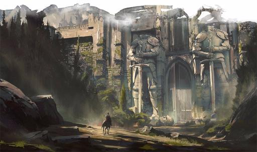

# Curse of Strahd Monday Nights

### The Party Movement Order;

|Player  |AKA           |Specialty                                                                   |
|---     |---           |---                                                                         |
|Erramus | Errandboy    | The Brains of the operation because he is the only one who can open a door |
|[Nikkey](Character.md)  | The provactur      | Stealth, locks or traps and action                   |   
|Skylarc | Shiela       | She gets pissed easily                                                     |
|Sebi    | Seabiscuit or Stinky | Strongest mage hand in the land                                    |
|Erebus  | Busboy       | Burning things and lover of elf's                                          |
|Nilneak | NillyWilly   | Eldritch blast first, ask questions later                                  | 

### NPC's encourtered by the party
___People who have given us quests;___ 
- Dutchy of Daggerfor - Motivations unkown, Husbans is dead and she is scared, sent us 
to find somemissing people.
- Rose & Thorn - Rosavalda Durnst unkown what they want us to play with them

___The People we are looking for;___ 
- Bella the Brave
- Krystopf - Fighter
- Joesline - Magic User 
- Dominique - Rogue - Likely Dead, Knikkey got his hand I think

___People of interest;___
- Strahd            - Bad guy, a Messiah, Not here to lead, we are on his earth
- Irena             - Bad guy,  Burgomasters Daughter
- Kolyan Indirovich - Neutral guy, Daughter bitten by vampire, seeks to help to contain a vile 
creature who has become to powerful, seeks to contain this power within Barovia, perhaps has a 
reward for Dominique, I am Dominique 
- Rose & Thorn      - Unknown - Rosavalda Durnst
- Gustav Durst      - Tortured people in his dungeon, motivations unknown, perhaps immortality
-  Durst Will Documents all Signed forged

### Places
- Barovia - Has a Devil that must be contained 
- Daggerford - Sword Coast Town, Nikkey Played a lot of Baldurs Bones there

### Quests 
- Find the missing people for Dutchy
- Rose and Thorn want us to play in scary house

### Items 
- blood velvet coin purse with 20 gold - Everyone
- Decayed Hand - Nikkey
- Tiger Rug - Nikkey
- __Dominique's Letter__

- __Strahd's Letter__  


- Durnst Documents - Will for property

#### Memorable Actions
- Nikkey convinces the Dutchess to give us all 20 gold peices to find some missing people.
- We all get enveloped by a thick unatural fog which we appear to be lost in until we find a 
gate with headless statues.

- Errebus gets us all inspiration for putting to rest a man who was hanging in a tree, probably 
one of the dead guys we have be looking for.
- Nicky Climbs the dead tree and sees a light  which they follow to big scary house
- Outside the light up house the Party agree's to take a look at the basement to ensure for a good 
nights rest.
- Once inside everyone is given a feast, except Nikkey does drugs upstairs and cannot sleep due to 
paranoia.
- After arguing over is the house safe, finally the decide to sleep.
- They wake to chills and appear to be walled in the House by bricks.

--------------------------------------------------------------------------------------
- Nikkey still high, can't sleep and eventually sees a spectral image of a servant and trys to wake 
everyone up. 
- Nilneak just wants to sleep even after everyone goes downstairs after hearing more noises downstairs
- A few of us go Downstairs after 30 minutes of trying to figure out how darkvision works in Roll20 
and we find a new party member a new Cleric Erasmus who actually probably likes elf's unlike some people
- After another 30 minutes  of trying to figure out whats going on, Nikkey daringly decides to open a door, 
which Seabiscuit decided was better to open using a mage hand but Nikkey slapped that mage hand away.
- The food everyone ate, was actually old and rotting and people are now getting poisened
- Unprovoked Nilneak just randomly decides to start vandalizing Rose and Thorns house with Eldritch Blasts
and gets attacked by glass eyed dog. Nilneak is clearly not an animal lover and has never heard of arson.
- After what seems like forever they go upstairs and nn a Dare, Nikkey sprung a suit of Trap of Magical Armor, 
Skylarc wrestled with the Magical Armor and threw it off the Balcony, then Nikkey Jumped off a 30 story 
Balcony, which he rolled a crit to vanquish the armor and save the day 
- As they searched more rooms found a Tigersking Rug/cloak and used it to creatively ensare a Broom with a crit, and immediatly 
after Erebus rolled a crit and smashed it to peices... Thats fucking Teamwork.
- He also found a treasure chest full of some documents, magical scrolls, and procurred a poison dart from
a trap. Poison was fatally strong enought kill someone.
- Strahds Letter - Nikkey examined Strahds letter and begain forging Documents from Strahds handwritting 
```
To whomever reads this letter, 

Please extend the finest hospitality Barovia has to offer to the companions who 
have this letter. Your lord expect you will treat them with the highest regard and 
equip them with whatever they so desire for which I will reimburse at twice the rate.

The penalty for not honoring my wishes and accomodating these traveler's will be 
dealt with extreme prudence.

Your dread lord and master,
Strahd von Zarovich
```
- Nikkey Examined - The Durst Deeds wants to take ownership of the properties, want's Rose and Thorns 
blessing to restore the house for the children
- Found a hidden Room, in the Doll House which was a miniature copy of the house
- Nikkey got really afraid after touching thorns Bear
__________________________________________________________

Next Steps, Goto Secret Room 


 
